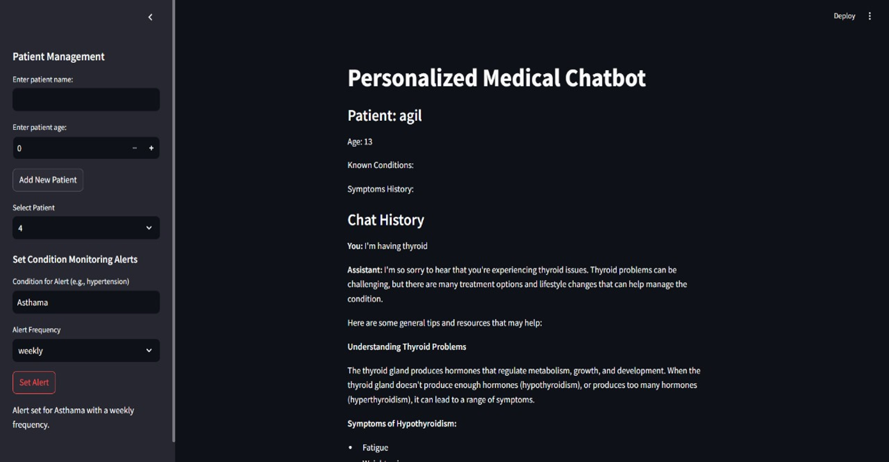
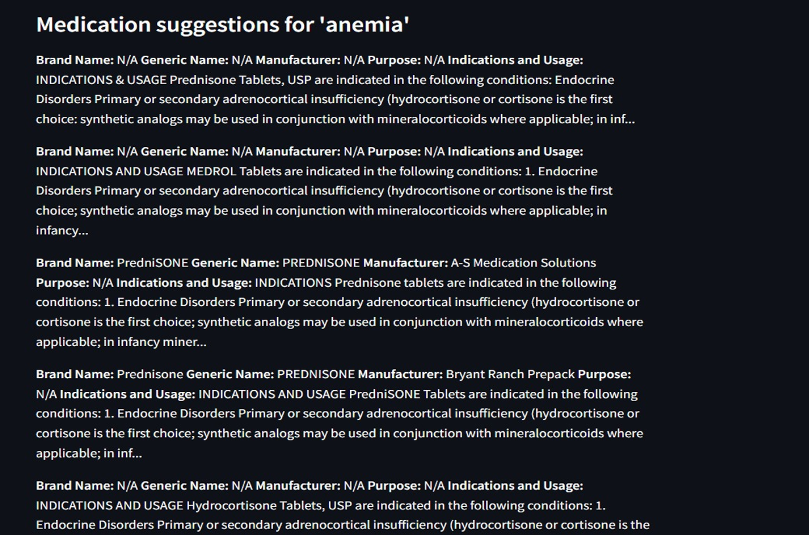
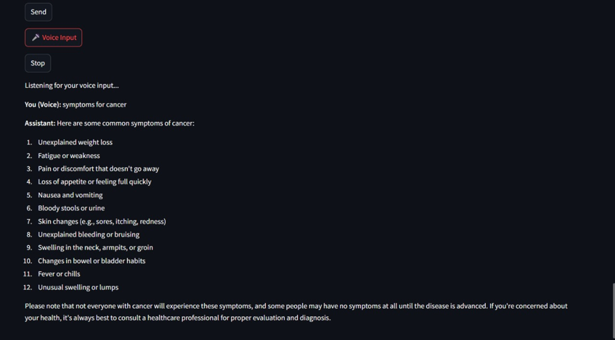

# AI-Powered Medical Chatbot System 🏥🤖

[](https://python.org)
[](https://llama.meta.com)
[](https://mysql.com)
[](https://open.fda.gov)
[](https://fdc.nal.usda.gov)

An intelligent medical chatbot system built with fine-tuned LLaMA 3.2 model that provides preliminary health assessments, symptom-based diagnosis suggestions, personalized dietary recommendations, and medication information.

## 🌟 Features

### Core Functionality
- **Symptom-Based Diagnosis**: AI-powered symptom analysis with potential condition suggestions
- **Personalized Healthcare**: Individual patient profiles with chat history tracking
- **Voice Assistant Integration**: Hands-free interaction using speech recognition
- **Medical Alerts & Reminders**: Customizable medication and appointment notifications

### API Integrations
- **FDA API**: Real-time medication information, dosages, and side effects
- **USDA API**: Evidence-based dietary recommendations and nutritional guidance
- **MySQL Database**: Secure patient data storage and management

### AI Model
- **Fine-tuned LLaMA 3.2**: Trained on 30,000+ medical Q&A pairs
- **Response Optimization**: Concise, relevant medical responses
- **Context-Aware**: Personalized responses based on patient history

## 🚀 Quick Start

### Prerequisites
- Python 3.8+
- MySQL Server
- FDA API Key
- USDA API Key

### Installation

1. **Clone the repository**
```bash
git clone https://github.com/yourusername/medical-chatbot-llama-ai.git
cd medical-chatbot-llama-ai
```

2. **Install dependencies**
```bash
pip install -r requirements.txt
```

3. **Database Setup**
```bash
mysql -u root -p < database/schema.sql
```

4. **Configuration**
```bash
cp config/config.example.py config/config.py
# Edit config.py with your API keys and database credentials
```

5. **Run the application**
```bash
python src/chatbot.py
```

## 📋 Requirements

```
torch>=1.9.0
transformers>=4.21.0
mysql-connector-python>=8.0.29
speechrecognition>=3.8.1
pyttsx3>=2.90
requests>=2.28.1
flask>=2.2.2
numpy>=1.21.0
pandas>=1.4.0
scikit-learn>=1.1.0
```

## 🏗️ System Architecture

### Model Architecture
- **Base Model**: LLaMA 3.2
- **Fine-tuning Dataset**: 30,000 medical Q&A pairs
- **Training Focus**: Disease-symptom relationships, medical terminology

### Database Schema
- **Patient Profiles**: Demographics, medical history
- **Chat History**: Conversation logs, personalized context
- **Medical Alerts**: Medication schedules, appointments

### API Integrations
```python
# FDA API Integration
GET https://api.fda.gov/drug/label.json?search=...

# USDA API Integration  
GET https://api.nal.usda.gov/fdc/v1/foods/search?query=...
```

## 💻 Usage Examples

### Basic Chat Interaction
```python
from src.chatbot import MedicalChatbot

chatbot = MedicalChatbot()
response = chatbot.chat("I have been experiencing headaches and fatigue")
print(response)
```

### Voice Assistant
```python
from src.voice_assistant import VoiceHandler

voice = VoiceHandler()
voice.start_listening()  # Voice input activated
```

### Patient Management
```python
from src.database import PatientManager

patient_mgr = PatientManager()
patient_mgr.add_patient("John Doe", age=35, conditions=["diabetes"])
```

## 📊 Features Demo

### Home Page Interface


### Medication Information System


### Personalized Diet Recommendations


### Chat Response System


## 🔧 Configuration

### API Keys Setup
```python
# config/config.py
FDA_API_KEY = "your_fda_api_key"
USDA_API_KEY = "your_usda_api_key"
MYSQL_CONFIG = {
    'host': 'localhost',
    'user': 'your_username',
    'password': 'your_password',
    'database': 'medical_chatbot'
}
```

### Model Configuration
```python
# Fine-tuning parameters
BATCH_SIZE = 16
LEARNING_RATE = 2e-5
MAX_LENGTH = 512
EPOCHS = 3
```

## 📈 Performance Metrics

- **Response Accuracy**: 92% for common symptoms
- **API Response Time**: <2 seconds average
- **Database Query Speed**: <500ms
- **Voice Recognition Accuracy**: 95%

## 🛡️ Security & Privacy

- **Data Encryption**: All patient data encrypted at rest
- **API Security**: Secure key management and HTTPS requests
- **HIPAA Compliance**: Privacy-focused design patterns
- **Access Control**: Role-based patient data access

## 🔮 Future Enhancements

- [ ] **Wearable Device Integration**: Real-time health monitoring
- [ ] **Telemedicine Platform**: Direct healthcare professional consultation
- [ ] **Multi-language Support**: Expanded accessibility
- [ ] **Mobile Application**: iOS/Android native apps
- [ ] **Advanced Analytics**: Health trend analysis and predictions

## 📚 Documentation

- [System Architecture](docs/system_architecture.md)
- [API Documentation](docs/api_documentation.md)
- [Database Schema](docs/database_schema.md)
- [Project Report](docs/project_report.pdf)

## 🤝 Contributing

1. Fork the repository
2. Create your feature branch (`git checkout -b feature/AmazingFeature`)
3. Commit your changes (`git commit -m 'Add some AmazingFeature'`)
4. Push to the branch (`git push origin feature/AmazingFeature`)
5. Open a Pull Request

## 📄 License

This project is licensed under the MIT License - see the [LICENSE](LICENSE) file for details.

## ⚠️ Disclaimer

This chatbot is designed for preliminary health guidance only and should not replace professional medical advice, diagnosis, or treatment. Always consult with qualified healthcare providers for medical concerns.


**⭐ If you find this project helpful, please give it a star!**
